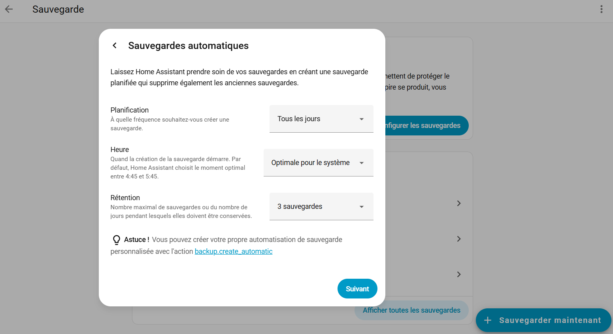

Pour installer Home Assistant, il est possible de passer par un script accessible à ce [lien](https://community-scripts.github.io/ProxmoxVE/scripts?id=haos-vm), fait par la communauté; ou bien de le faire manuellement.

### Via le script
Comme dit plus tôt, le script est accessible depuis ce [lien](https://community-scripts.github.io/ProxmoxVE/scripts?id=haos-vm).  
Il suffit d'ouvrir le shell du node, et de taper ma commande suivante :  
``bash -c "$(curl -fsSL https://raw.githubusercontent.com/community-scripts/ProxmoxVE/main/vm/haos-vm.sh)"``

Il est possible de faire une configuration classique,. Mais pour une configuration avancée, voici des indications sur les différents paramètres :  
**Version** : préférer l'option Stable  
**VM ID** : choisir un ID disponible  
**Machine** : préférer q35 pour une meilleure compatibilité et efficacité  
**Disk size** : minimum 32Go  
**Disk cache** : laisser par défaut  
**Hostname** : choisir un nom, ex : HomeAssistant  
**CPU Model** : KVM64 pour une possibilité de migration / host pour une meilleure performance  
**Core count** : 2 cores  
**RAM** : 2Go mini, 4Go recommandé  
**Bridge** : carte réseau du proxmox, probablement vmbr0  
**Mac address** : Laisser par défaut  
**VLAN** : à configurer si besoin, sinon laisser par défaut  
**MTU Size** : laisser par défaut  
**Storage pools** : préférer local-lvm pour réduire les dépendances  

La configuration est terminée.  
Démarrer la VM.  
Une fois l'installation finie, accéder à l'interface web via navigateur à http:// IPmachine :8123/  
L'IP de la VM est visible dans **Summary**.  
On peut également y accéder via http:// VMhostname.local:8123/  

### Installation manuelle
#### Création de la VM
**Create VM**  
**General** : Choisir un VM ID et nom  
**OS** : Cocher : Do not use any media  
**System** : BIOS : UEFI  
EFI Storage : local  
Décocher "Pre-Enroll keys"  
**Disks** : Supprimer le disque  
**CPU** : Cores : 2  
**Type** : host  
**RAM** : 2/4 Go  
**Network** : laisser par défaut  

#### Importation de l'image disque
Dans le shell du node :  
Créer un dossier pour contenir l'image du disque : ``mkdir -p /var/lib/vz/template/qcow``  
Y aller : ``cd /var/lib/vz/template/qcow``  
Télécharger l'image disque qcow2 trouvable [ici](https://www.home-assistant.io/installation/alternative) : ``wget https://github.com/home-assistant/operating-system/releases/download/16.3/haos_ova-16.3.qcow2.xz -O haos_ova-16.3.qcow2.xz ``  
(-O haos_ova-16.3.qcow2.xz  permet de forcer le nom du fichier téléchargé à prendre le nom "haos_ova-16.3.qcow2.xz)  
Extraire le fichier compressé obtenu : ``unxz haos_ova-16.3.qcow2.xz``  
Importer l'image du disque dans la VM ayant pour ID 100 : ``qm importdisk 100 /var/lib/vz/template/qcow local-lvm``  
(on entre le path de l'image disque puis l'endroit ou est stocké l'EFI storage choisi à la création de la VM, ici local-lvm)  
Aller dans **Hardware** de la VM, sélectionner le Unused disk, Edit, cocher **Discard**, Add.  
Aller dans **Options** de la VM, sélectionner Boot Order, Edit, cocher le scsi0, le placer en premier ou décocher les autres.  

#### Accès à l'interface web
Démarrer la VM.  
Une fois l'installation finie, accéder à l'interface web via navigateur à http:// IPmachine :8123/  
L'IP de la VM est visible dans **Summary**.  
On peut également y accéder via http:// VMhostname .local:8123/  

## Premières configurations
Une fois sur http:// IPmachine :8123/ il est possible de créer la maison connectée ou de récupérer une sauvegarde. Nous allons procéder à sa création.  
Créer un utilisateur, déterminer la position, et terminer.  

Choisir une adresse IP statique.  
Aller dans **Paramètres**, **Système**, **Réseau**, **IPv4** et cocher **Statique**.  

### Sécurité
Pour mettre en place une sauvegarde automatisée :  
Aller dans **Paramètres**, **Système**, **Sauvegardes**. 
Cliquer sur **Configurer les sauvegardes**.  
Il est possible de suivre la procédure Recommandée ou de Personnaliser.  
Si le choix est personnalisé, il est possible de déterminer la fréquence via **Planification** (une fois par jour, ou quel(s) jour(s) de la semaine), l'**heure** et la **rétention**.    
  

Choisir les données à inclure dans les sauvegardes.    

Dans les paramètres de la sauvegarde, récupérer la clé de chiffrement AES-128, essentielle pour restaurer les sauvegardes. Il est judicieux de la sauvegarder dans un gestionnaire de mots de passe.  
Sélectionner l'emplacement de stockage : par défaut c'est le disque local, mais il est recommandé de choisir un emplacement externe (NAS, cloud, etc.) afin de respécter la règle 3-2-1.  
Toutes les configurations peuvent être modifiées plus tard.  
